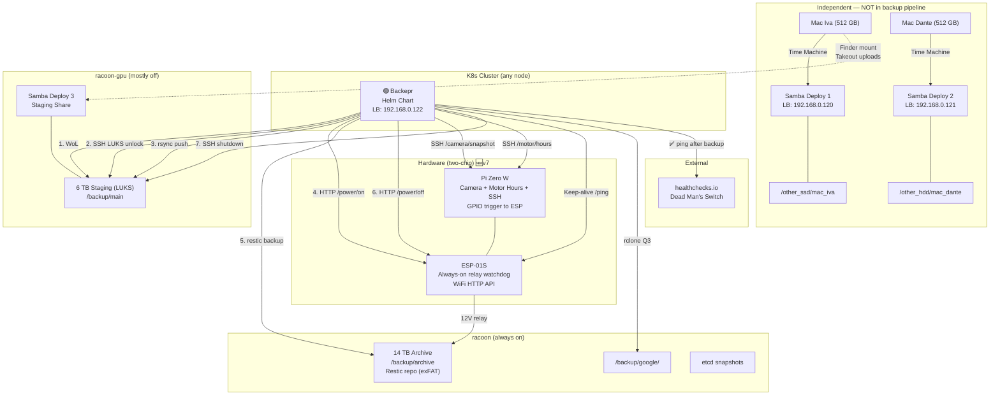
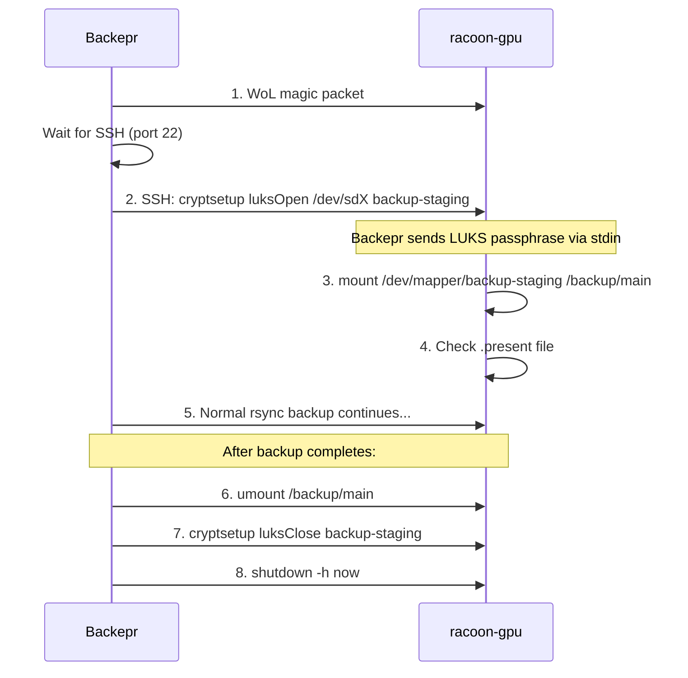
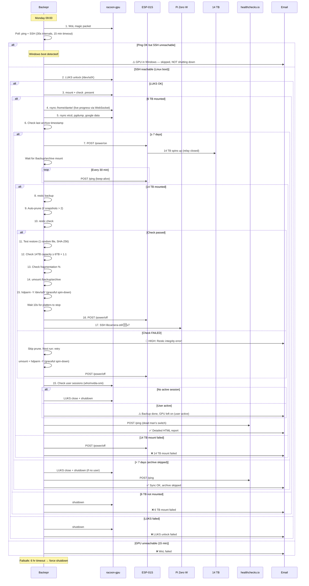
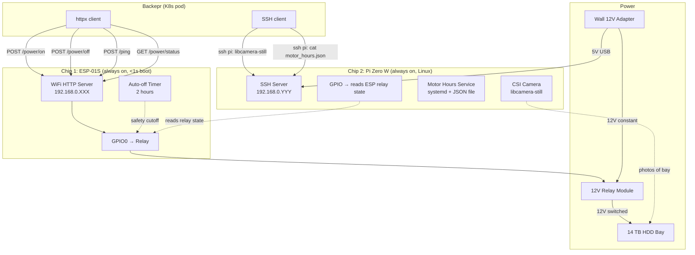

# Backepr — Backup Architecture v7

> Complete implementation spec. v7: two-chip hardware controller (Pi Zero W + ESP-01S). Previous changes marked 🆕v6. Two-chip changes marked 🆕v7.

---

## 1. Naming & Concepts

| Term | Meaning |
|------|---------|
| **Backepr** | Backup orchestrator — K8s Helm chart deployment with web UI |
| **Staging** | 6 TB HDD on `racoon-gpu` (`/backup/main`) — LUKS encrypted 🆕v6 |
| **Archive** | 14 TB HDD on `racoon` (`/backup/archive`) — Restic repo, encrypted, exFAT |
| **Mac TM** | Two independent Time Machine setups — not part of the backup pipeline |

---

## 2. Infrastructure

| # | Node | Hostname | Storage | Mount Path | Power |
|---|------|----------|---------|-----------|-------|
| 1 | RTX 3090 PC | `racoon-gpu` | 6 TB HDD (staging, LUKS) 🆕v6 | `/backup/main` | Off; woken via WoL. **May boot Windows (gaming)** 🆕v6 |
| | | | Samba staging share | `/backup/main` (SMB) | Available only when Linux + mounted |
| 2 | Radxa X4 | worker | — | — | Always on |
| 3 | HP EliteDesk 850 G9 | `racoon` | 1 TB SSD #1 (Iva's TM) | `/other_ssd/mac_iva` | Always on |
| | | | 1 TB SSD #2 (Dante's TM) | `/other_hdd/mac_dante` | Always on |
| | | | 14 TB WD Enterprise (archive) | `/backup/archive` | Pi Zero W + ESP-01S relay (12V bay power) 🆕v7 |

> [!NOTE]
> **Backepr runs on any node** — 3-node etcd, no pinning needed.
> **`racoon-gpu` may boot Windows** for gaming. Backepr must detect this: node responds to ping but SSH is unreachable → Windows boot → skip backup, don't shut down. 🆕v6

---

## 3. Architecture Diagram



### 4-Tier Strategy

| Tier | Data | Location | Schedule | Tool |
|------|------|----------|----------|------|
| **1 — Live TM** | Mac backups | 2 × 1 TB SSDs (`racoon`) | Continuous (macOS) | Samba × 2 |
| **2 — Staging** | Home dir, etcd, DB dumps, Google data, Takeout | 6 TB LUKS (`racoon-gpu`) 🆕v6 | Weekly (Monday 09:00) | rsync via SSH + Samba |
| **3 — Archive** | Deduplicated cold copy | 14 TB (`racoon`) | Weekly (if ≥7 days) | Restic (encrypted, auto-pruned) |
| **4 — Cloud Pull** | Google Drive + Docs | `racoon` local → 6 TB | Every 3 months | rclone |

---

## 4. Backepr — Detailed Design

### 4.1 Deployment Model — Helm Chart

```
Namespace:       backepr
Helm Chart:      workload/backepr/chart/
Deployment:      backepr
Service:         backepr-service (LoadBalancer: 192.168.0.122)
ConfigMap:       backepr-config
Secret:          backepr-secrets
ServiceAccount:  backepr-sa
```

Ansible playbook for hardware. Helm chart for K8s. All passwords from `vars.yaml`.

### 4.2 ConfigMap

```yaml
apiVersion: v1
kind: ConfigMap
metadata:
  name: backepr-config
  namespace: backepr
data:
  config.yaml: |
    # ─── GPU Node ────────────────────────────────
    gpu_node:
      hostname: "racoon-gpu"
      ssh_user: "dante"
      mac_address: "{{ backepr.gpu_mac_address }}"
      staging_path: "/backup/main"
      mount_check_file: ".present"
      auto_shutdown: true
      shutdown_timeout_hours: 6
      luks_device: "/dev/sdX"                            # 🆕v6
      luks_name: "backup-staging"                        # 🆕v6
      dual_boot: true                                    # 🆕v6
      user_session_check: true                           # 🆕v6 don't shutdown if user active

    # ─── Archive ─────────────────────────────────
    archive:
      mount_path: "/backup/archive"
      restic_repo: "/backup/archive/restic-repo"
      mount_check_file: ".present"
      device: "/dev/sdY"                                # for hdparm spin-down 🆕v6.2
      spindown_wait_seconds: 10                          # wait after hdparm -Y 🆕v6.2

    # ─── Hardware Controller (Pi Zero W + ESP-01S) ── 🆕v7
    hardware_controller:
      # ESP-01S — always-on relay watchdog
      esp_address: "http://{{ backepr.esp01s_ip }}"
      power_on: "/power/on"
      power_off: "/power/off"
      status: "/power/status"
      ping: "/ping"
      keep_alive_interval_minutes: 30
      auto_off_timeout_minutes: 120
      # Pi Zero W — brain (camera + motor hours + SSH) 🆕v7
      pi_address: "{{ backepr.pi_zero_ip }}"
      pi_ssh_user: "pi"
      camera_enabled: true
      snapshot_on_power_change: true           # snap before power-on, after power-off
      motor_hours_warn_threshold: 20000        # hours — alert if exceeds

    # ─── Backup Sources ─────────────────────────
    backup_sources:
      - name: "home_racoon"
        source: "/home/dante/"
        node: "racoon"
        destination: "home/racoon/"
      - name: "home_gpu"
        source: "/home/dante/"
        node: "racoon-gpu"
        destination: "home/racoon-gpu/"
      - name: "home_worker"
        source: "/home/dante/"
        node: "worker"
        destination: "home/worker/"
      - name: "etcd_snapshot"
        source: "/var/lib/etcd-backup/"
        destination: "etcd/"
      - name: "eater_db_dump"
        source: "/var/backups/eater-pgdump/"
        destination: "databases/eater/"
      - name: "google_data"
        source: "/backup/google/"
        destination: "google/"

    # ─── Schedules ───────────────────────────────
    schedules:
      timezone: "Europe/Warsaw"                            # 🆕v6.1
      weekly_backup:
        cron: "0 9 * * 1"
        description: "Monday 09:00 Warsaw — full backup cycle"
      google_pull:
        cron: "0 3 1 */3 *"
        description: "Every 3 months — rclone Google data"
      google_takeout_reminder:
        cron: "0 10 1 */3 *"
        description: "Every 3 months — email reminder for Takeout"

    # ─── Restic Retention ────────────────────────
    restic_retention:
      keep_weekly: 4
      keep_monthly: 6
      keep_yearly: 2
      auto_prune: true
      min_snapshots: 2
      test_restore_after_archive: true                   # 🆕v6

    # ─── Storage Health ──────────────────────────
    storage_health:
      archive_capacity_check:
        required_free_ratio: 1.10
        alert_on_failure: true
      staging_capacity_check:
        warn_percent_used: 85
        critical_percent_used: 95
      fragmentation_check: true
      fragmentation_warn_percent: 30
      smart_monitoring:                                  # 🆕v6.1
        enabled: true
        drives:
          - name: "6TB Staging"
            node: "racoon-gpu"
            device: "/dev/sdX"               # confirm actual device
          - name: "14TB Archive"
            node: "racoon"
            device: "/dev/sdY"               # confirm actual device
        alert_on_reallocated_sectors: true
        alert_on_pending_sectors: true
        alert_on_temperature_celsius: 55
        check_interval: "during_backup"      # read SMART when drive is accessible
        motor_hours_from_pi: true              # 🆕v7 compare SMART hours vs Pi counter

    # ─── Logging ─────────────────────────────────  🆕v6
    logging:
      retention_months: 4
      store_success_file_list: false       # DON'T log every successful file
      store_failed_file_list: true         # DO log failed files
      store_system_events: true            # DO log system events
      store_hash_check_results: true       # DO log integrity check results
      max_log_size_mb: 50

    # ─── Notifications ───────────────────────────
    notifications:
      email:
        enabled: true
        smtp_host: "{{ backepr.smtp_host }}"
        smtp_port: 587
        from: "{{ backepr.email_from }}"
        to: "{{ backepr.email_to }}"
        html_reports: true                               # 🆕v6
      on_success: true
      on_failure: true
      dead_mans_switch:                                  # 🆕v6
        enabled: true
        url: "https://hc-ping.com/{{ backepr.healthcheck_uuid }}"
        max_days_without_backup: 14

    # ─── Error Handling ──────────────────────────  🆕v6
    error_handling:
      max_retries_per_step: 2
      retry_delay_seconds: 60
      on_restic_check_failure: "alert_and_stop"
      on_restic_check_failure_next_run: "retry"
      ssh_connection_timeout: 30
      ssh_known_hosts_strict: true
```

### 4.3 Secrets (from `vars.yaml`)

```yaml
apiVersion: v1
kind: Secret
metadata:
  name: backepr-secrets
  namespace: backepr
type: Opaque
stringData:
  restic_password: "{{ backepr.restic_password }}"
  ssh_private_key: "{{ backepr.ssh_private_key }}"
  smtp_password: "{{ backepr.smtp_password }}"
  rclone_config: "{{ backepr.rclone_config }}"
  luks_passphrase: "{{ backepr.luks_passphrase }}"       # 🆕v6
  healthcheck_uuid: "{{ backepr.healthcheck_uuid }}"     # 🆕v6
```

### 4.4 Data Protection — Hybrid Approach

| Layer | Protection | How |
|-------|-----------|-----|
| **Filesystem** | Dedicated `backup` user, POSIX ACLs, no delete | `setfacl` + immutable parent dirs |
| **LUKS** 🆕v6 | 6 TB staging encrypted at rest | Remote unlock via SSH after WoL boot |
| **Restic** | Hybrid auto-prune (min 2 snapshots) | `restic forget --prune` with pre-check |
| **Test restore** 🆕v6 | Verify 1 random file after each archive | Restore + checksum compare |
| **SSH** | Restricted key, no sudo, no `rm` | `command=` in authorized_keys |
| **K8s** | Read-only RBAC | `get`, `list`, `watch` only |

### 4.5 Tech Stack

| Component | Choice | Why |
|-----------|--------|-----|
| **SSH/rsync/restic** | Python `subprocess` (native SSH) | Battle-tested OpenSSH, no extra deps |
| **HTTP client** | `httpx` (async) | Hardware controller + healthchecks.io calls |
| **Scheduler** | APScheduler | In-process, reads cron from ConfigMap |
| **Web framework** | FastAPI | Async, serves API + static UI |
| **Live progress** 🆕v6 | WebSocket (FastAPI) | Stream rsync/restic output to dashboard |
| **Frontend** | HTML/CSS/JS (responsive dark UI) 🆕v6 | Mobile-friendly, no build step |
| **Container** | Python 3.12 slim + rsync + restic + rclone + openssh + cryptsetup | Single container |

### 4.6 Web UI

| Page | Features |
|------|----------|
| **Dashboard** | Tier status cards, disk usage bars, capacity health, **live progress bar during backup** 🆕v6, node status, **fragmentation indicator** 🆕v6 |
| **Actions** | Buttons: Wake GPU, LUKS Unlock, Start Sync, Start Archive, Google Pull, HDD On/Off, Camera Snap, GPU Shutdown 🆕v7 |
| **Logs** | Filterable by tier/date. **Events + failures only, no success file lists** 🆕v6 |
| **History** | Table: date, tier, status, duration, bytes transferred, snapshot ID, **test restore result** 🆕v6 |
| **Health** | Node status, mount status, ESP-01S + Pi Zero W health, SMART, motor hours 🆕v7, capacity check (14 TB ≥ 6 TB × 1.1), **fragmentation %** 🆕v6, **dead man's switch status** 🆕v6, **camera feed** 🆕v7 |
| **Config** | Read-only ConfigMap view + masked secrets |
| **Prune** | Auto-prune runs after archive (min 2 safety). Manual button also available |

> [!NOTE]
> **Responsive design** 🆕v6 — Dashboard works on phone screens. Check backup status from work on Monday while GPU is syncing.

---

## 5. Error Handling & Fault Tolerance 🆕v6

> Every failure mode has a defined response. Backepr never silently fails.

### 5.1 Error Matrix

| # | Failure | Detection | Response | Retry? |
|---|---------|-----------|----------|:---:|
| 1 | **WoL failed — GPU didn't wake** | SSH unreachable after 15 min | ❌ Alert email, log event | Next Monday |
| 2 | **GPU booted Windows** (gaming) 🆕v6 | Ping succeeds but SSH port 22 unreachable | ⚠️ Alert: "GPU on but in Windows — backup skipped". **Do NOT shutdown** | Next Monday |
| 3 | **GPU booted Linux, user gaming/AI** 🆕v6 | SSH works, `who`/`loginctl` shows session OR `nvidia-smi` shows GPU load | ✅ Run backup, ⚠️ **skip auto-shutdown**, alert: "Backup done, machine left on — active session" | N/A |
| 4 | **LUKS unlock failed** 🆕v6 | `cryptsetup luksOpen` returns error | ❌ Alert: "LUKS unlock failed — wrong passphrase?", shutdown GPU | Next Monday |
| 5 | **6 TB not mounted** (`.present` missing) | `mountpoint` check fails | ❌ Alert, shutdown GPU | Next Monday |
| 6 | **rsync partial failure** (some files) | rsync exits with code 23/24 | ⚠️ Continue backup, log failed files, alert with list | Next Monday (incremental catches up) |
| 7 | **rsync total failure** (network/SSH) | rsync exits with code >24 | ❌ Alert, shutdown GPU | Retry once after 60s, then give up |
| 8 | **ESP-01S unreachable** 🆕v7 | HTTP timeout on ESP-01S `/power/on` | ❌ Alert: "Can't power on 14 TB — ESP-01S offline", skip archive, shutdown GPU | Next Monday |
| 9 | **14 TB mount failed** | `.present` missing after relay power-on | ❌ Alert, send `/power/off`, shutdown GPU | Next Monday |
| 19 | **Pi Zero W unreachable** 🆕v7 | SSH to Pi times out | ⚠️ Log warning. Non-critical — camera/motor-hours unavailable, backup continues via ESP relay | N/A |
| 20 | **Camera failure** 🆕v7 | `libcamera-still` returns error | ⚠️ Log warning. Non-critical — backup continues. Debug via SSH | N/A |
| 10 | **Restic backup failed** | restic exits non-zero | ❌ Alert, do NOT prune, power off 14 TB, shutdown GPU | Retry once |
| 11 | **Restic check failed** (integrity) 🆕v6 | `restic check` finds errors | 🔴 **HIGH PRIORITY alert**, skip prune, log error details. Next run: **retry check**. If fails again: stop and wait for manual `restic rebuild-index` | Manual fix, then auto-retry |
| 12 | **Auto-prune refused** (≤2 snapshots) | Snapshot count check | ⚠️ Alert: "Only N snapshots, prune skipped" | N/A |
| 13 | **Test restore mismatch** 🆕v6 | SHA-256 of restored file ≠ source | 🔴 **HIGH ALERT**: "Backup integrity issue — restored file doesn't match source" | Manual investigation |
| 14 | **14 TB capacity insufficient** | Free space < staging used × 1.10 | ⚠️ Alert: "Archive running low — manual prune or expand needed" | Shows in every backup report |
| 15 | **SSH connection drops mid-rsync** | rsync exits unexpectedly | rsync `--partial` preserves transferred data. Retry once. | Retry once |
| 16 | **GPU didn't shutdown** (stuck) | Post-shutdown ping still succeeds after 5 min | ⚠️ Alert: "GPU shutdown may have failed" | Log only |
| 17 | **Backepr itself is down** 🆕v6 | healthchecks.io doesn't receive ping for 14 days | 🔴 **External alert** from healthchecks.io to your email | N/A — external |
| 18 | **Power failure during archive write** | Restic check on next run detects corruption | 🔴 Alert, try `restic rebuild-index`. Worst case: re-init repo from 6 TB staging (one week of archive lost, acceptable) | Auto-retry rebuild |

### 5.2 Retry Strategy

```
Each backup step follows:
1. Execute step
2. If failed:
   a. Wait retry_delay_seconds (60s)
   b. Retry (max max_retries_per_step = 2)
   c. If still failed → log, alert, move to cleanup
3. Cleanup always runs (graceful spin-down + ESP-01S off, GPU shutdown check)
```

### 5.3 Dead Man's Switch 🆕v6

```
After every SUCCESSFUL backup:
  → POST https://hc-ping.com/{uuid}

healthchecks.io config:
  - Period: 14 days
  - Grace: 2 days
  - If no ping for 16 days → email alert to backepr.email_to
```

This catches: Backepr pod crash, K8s namespace deleted, node failure, network issues — anything that stops backups silently.

---

## 6. LUKS Encryption — 6 TB Staging 🆕v6

### Why
The 6 TB staging drive has ALL your data in plain text. If `racoon-gpu` is stolen (it's a gaming PC, might be near a window or in an accessible area), everything is exposed. LUKS encrypts the entire partition at rest.

### How It Works



### Setup (one-time, in Ansible hardware-setup)

```bash
# Format with LUKS (will prompt for passphrase — stored in vars.yaml)
cryptsetup luksFormat /dev/sdX
cryptsetup luksOpen /dev/sdX backup-staging
mkfs.ext4 /dev/mapper/backup-staging      # ext4 under LUKS (not exFAT)
mount /dev/mapper/backup-staging /backup/main
touch /backup/main/.present
umount /backup/main
cryptsetup luksClose backup-staging
```

> [!IMPORTANT]
> Under LUKS, the filesystem is **ext4** (not exFAT). LUKS provides encryption, ext4 provides journaling. The 6 TB drive doesn't need Mac-compatibility — only the 14 TB archive drive needs that (exFAT stays for 14 TB).

### Remote Unlock via SSH

Backepr SSHes to `racoon-gpu` and runs:
```bash
echo "$LUKS_PASSPHRASE" | cryptsetup luksOpen /dev/sdX backup-staging -
mount /dev/mapper/backup-staging /backup/main
```

The LUKS passphrase is stored in the `backepr-secrets` K8s Secret (from `vars.yaml`). The Ansible playbook prompts for it during initial setup.

---

## 7. Google Data — Policy & Workflow

> [!WARNING]
> **Google Photos API broken since March 2025.** Use Google Takeout.

| Google Service | rclone | Status |
|----------------|:---:|--------|
| **Google Drive** | ✅ | OAuth personal use, 750 GB/day limit |
| **Google Docs** | ✅ | Auto-exported as Office/PDF |
| **Google Photos** | ❌ | Takeout only |

### Takeout Workflow
1. 📧 Backepr reminder every 3 months
2. Download Takeout ZIP to Mac
3. Wake GPU via Backepr UI
4. Mount 6 TB in Finder: `Cmd+K` → `smb://192.168.0.123/staging`
5. Drop ZIP into `/google/photos/`
6. Next archive cycle backs up to 14 TB

---

## 8. Staging Samba Share (6 TB)

| | Samba Deploy 3 (Staging) |
|---|---|
| **HostPath** | `/backup/main` |
| **Share** | `staging` |
| **LB IP** | `192.168.0.123` |
| **Node affinity** | `racoon-gpu` |
| **Access** | Read/write (for Takeout uploads, browsing) |

> Only available when `racoon-gpu` is on + LUKS unlocked.

---

## 9. Backup Sources

| Source | Path | Node | Tool | Schedule |
|--------|------|------|------|----------|
| **Home dir** | `/home/dante/` | `racoon` | rsync → 6 TB | Weekly |
| **Home dir** | `/home/dante/` | `racoon-gpu` | rsync → 6 TB | Weekly |
| **Home dir** | `/home/dante/` | `worker` | rsync → 6 TB | Weekly |
| **etcd** | `/var/lib/etcd-backup/` | `racoon` | `etcdctl snapshot` → rsync | Weekly |
| **Eater DB** | PVC on `racoon` | `racoon` | pg_dump → rsync | Weekly |
| **Google Drive** | `/backup/google/` | `racoon` | rclone → rsync | Q3 months |
| **Google Photos** | Mac → Samba staging | — | Manual Takeout → Finder | Ad-hoc (Q3 reminder) |

---

## 10. Full Weekly Sequence



---

## 11. Notifications — Detailed Reports 🆕v6

### HTML Email Template

Every backup email includes:

```
┌──────────────────────────────────────┐
│  📦 Backepr Weekly Report            │
│  Monday, March 3, 2026 09:00        │
├──────────────────────────────────────┤
│  Status: ✅ SUCCESS                  │
│                                      │
│  Staging Sync:                       │
│    Duration: 1h 23m                  │
│    Transferred: 12.4 GB (284 files)  │
│    Failed files: 0                   │
│                                      │
│  Archive:                            │
│    Snapshot ID: a3f8d1b6             │
│    Duration: 45m                     │
│    New data: 8.2 GB                  │
│    Total repo size: 892 GB           │
│                                      │
│  Test Restore: ✅ PASS               │
│    File: home/projects/app.py        │
│    SHA-256: match                    │
│                                      │
│  Storage Health:                     │
│    6 TB: 2.1 TB used (35%) ✅        │
│    14 TB: 892 GB used (6.2%) ✅      │
│    Capacity: 14TB can fit 6TB×1.1 ✅ │
│    Fragmentation: 3% ✅              │
│                                      │
│  Retention:                          │
│    Snapshots: 8 (pruned 2 expired)   │
│    Oldest: 2026-01-06                │
│    Newest: 2026-03-03                │
│                                      │
│  Next scheduled: Monday Mar 10 09:00 │
│  Dead man's switch: ✅ pinged        │
└──────────────────────────────────────┘
```

### Alert Priority Levels

| Level | When | Action |
|-------|------|--------|
| **🔴 HIGH** | Restic integrity failure, test restore mismatch | Immediate email, stop operations, wait for manual fix |
| **❌ ERROR** | WoL failed, mount failed, LUKS failed | Email, skip backup, retry next week |
| **⚠️ WARNING** | GPU in Windows, user session active, capacity low, fragmentation high | Email, continue where possible |
| **✅ SUCCESS** | Everything worked | Detailed HTML report email |

---

## 12. Two-Chip Hardware Controller — HDD Bay Power + Monitoring 🆕v7

> [!NOTE]
> **v7 upgrade**: Replaced single ESP-01S with a **Raspberry Pi Zero W + ESP-01S** pair. The ESP-01S stays as the always-on relay watchdog (simple, reliable, boots in <1s). The Pi Zero W is the brain — Linux, SSH, CSI camera, Python motor-hours service. **Best of both worlds**: ESP reliability for relay safety + Pi flexibility for everything fun.

### 12.1 Chip Interconnection Diagram



### 12.2 Why Two Chips?

| | Single ESP-01S (v6) | Pi Zero W + ESP-01S (v7) |
|---|---|---|
| **Relay control** | ESP GPIO directly | ESP GPIO directly — same, proven, reliable |
| **Relay safety** | ESP auto-off timer | ESP auto-off timer — unchanged, boots in <1s |
| **Camera** | ❌ Not possible | ✅ Pi CSI camera — `libcamera-still`, full resolution |
| **Motor hours** | ❌ No tracking | ✅ Pi Python service, JSON file, infinite storage |
| **Remote debug** | OTA flash only | ✅ `ssh pi@...` — full Linux, real-time debugging |
| **Programming** | Need USB programmer | ✅ SSH into Pi from anywhere, edit code live |
| **Fun factor** | Boring relay switch | 🎉 Camera + motor-hours + SSH + Python = playground |

### 12.3 Chip Responsibilities

#### Chip 1 — ESP-01S (Always-On Relay Watchdog)

**Role**: Relay control + safety timer + visual state indicator

- GPIO0 controls 12V relay for HDD bay power
- **Built-in LED state indicator** (visual debugging):
  - **Relay OFF**: Blinks every 1 second (1s cycle)
  - **Relay ON**: 5 seconds ON, 1 second OFF (6s cycle)
- WiFi HTTP server: `/power/on`, `/power/off`, `/power/status`, `/ping`
- Auto-off timer: 2 hours, reset by `/ping` keep-alive
- **This chip's job is to be dumb and reliable** — it switches the relay and shows status
- If the Pi crashes, the ESP still cuts power after timeout
- Pull-up resistors ensure relay stays OFF during boot

> [!IMPORTANT]
> **The ESP-01S firmware is very close to v6** (now with LED blink patterns). No UART, no bridge, no complexity. Same 3 endpoints, same auto-off. The Pi is an independent chip that adds features without touching the relay safety path.

#### Chip 2 — Raspberry Pi Zero W (Brain)

**Role**: Camera + motor-hours + SSH debug — **all the fun stuff**

- **Camera**: Pi Camera Module v1.3 (or v2) via CSI ribbon cable
  - `libcamera-still -o /tmp/bay.jpg --width 1280 --height 720`
  - Snap before power-on, after power-off
  - Backepr fetches via `ssh pi@IP cat /tmp/bay.jpg`
- **Motor-hour counter**: Python systemd service
  - Polls ESP `/power/status` every 60 seconds
  - When `powered: true` → increments counter
  - Persists to `/home/pi/motor_hours.json`
  - No EEPROM limitations — SD card, unlimited writes
  - Backepr reads via `ssh pi@IP cat /home/pi/motor_hours.json`
- **SSH access**: Full remote debugging
  - `ssh pi@192.168.0.YYY` from anywhere on the network
  - Edit Python scripts live, restart services, view logs
  - `journalctl -u motor-hours -f` for real-time monitoring
- **GPIO**: Can read ESP relay state for motor-hours accuracy
  - Wire ESP GPIO0 → Pi GPIO (with voltage divider 3.3V safe)
  - Or just poll ESP HTTP `/power/status` — simpler, no wiring

### 12.4 Communication Between Chips

**The two chips are independent** — no UART, no I2C, no complex protocol:

```
┌─────────────────────────────────────────────┐
│             Network (WiFi)                   │
│                                              │
│   Backepr ←──HTTP──→ ESP-01S (relay)        │
│   Backepr ←──SSH───→ Pi Zero W (brain)      │
│   Pi Zero W ←──HTTP──→ ESP-01S (polling)    │
│                                              │
└─────────────────────────────────────────────┘

  Optional GPIO wire (for faster relay state reads):
    ESP-01S GPIO0 ──→ voltage divider ──→ Pi GPIO17
```

> [!TIP]
> **No UART bridge needed.** Both chips have WiFi. The Pi polls the ESP's HTTP API to track relay state. Backepr talks to each chip independently. This is simpler and more robust than a serial bridge.

### 12.5 Wiring Diagram 🆕v7

```
                            ┌───────────────────────────────────────────────────┐
                            │              HDD Bay Enclosure                     │
                            │                                                   │
  ┌─────────────┐  12V in   │  ┌──────────────────────┐  ┌──────────────────┐  │
  │  Wall 12V   │──────────→│  │  ESP-01S Relay Board  │  │  12V Relay       │  │
  │  Power      │           │  │                       │  │  Module          │  │
  │  Adapter    │           │  │  12V → 3.3V regulator │  │                  │  │
  └─────────────┘           │  │  WiFi HTTP server     │  │  IN ← ESP GPIO0 │  │
                            │  │  Auto-off timer (2h)  │  │  OUT → HDD 12V  │  │
                            │  └──────────────────────┘  └────────┬─────────┘  │
                            │                                      │            │
                            │  ┌──────────────────────┐           │ 12V power  │
  ┌─────────────┐  5V USB   │  │  Pi Zero W            │           │            │
  │  racoon     │──────────→│  │                       │  ┌───────┴──────────┐ │
  │  USB port   │           │  │  CSI → Pi Camera      │  │  14 TB WD HDD    │ │
  └─────────────┘           │  │  WiFi → SSH           │  │                  │ │
                            │  │  Motor hours service  │  │  (enterprise)    │ │
                            │  │  Python + systemd     │  │                  │ │
                            │  └──────────────────────┘  └──────────────────┘ │
                            │                                                   │
                            │  No data wires between boards — WiFi only         │
                            └───────────────────────────────────────────────────┘
```

> [!IMPORTANT]
> **The relay cuts power to the ENTIRE bay** (both 12V motor + 5V logic). Same as v6. The ESP controls relay GPIO directly — the Pi does NOT touch the relay.

> [!WARNING]
> **Pi Zero W must be powered independently** (5V USB from racoon or separate adapter). Do NOT power it from the 12V relay circuit — when the relay cuts power, the Pi must stay on to track motor hours and take post-power-off photos.

### 12.6 Graceful Spin-Down Sequence (unchanged from v6.2)

> [!WARNING]
> **NEVER cut relay power while the drive is spinning.** Same rule as v6.2.

**The correct power-off sequence:**
```
1. Backepr: umount /backup/archive           # unmount filesystem
2. Backepr: hdparm -Y /dev/sdY               # park heads + stop motor
3. Backepr: sleep 10                          # wait for platters to stop
4. Backepr: POST /power/off to ESP-01S       # ESP opens relay — 12V cut
5. Backepr: SSH pi: libcamera-still           # 🆕v7 snap — verify bay LEDs off
6. Pi: motor_hours service detects power off  # updates JSON counter
```

### 12.7 HTTP API — ESP-01S (unchanged from v6.2)

| Endpoint | Method | Action |
|----------|--------|--------|
| `/power/on` | POST | Close relay → bay powers on, reset auto-off timer |
| `/power/off` | POST | Open relay → bay loses power (call AFTER hdparm!) |
| `/power/status` | GET | `{"powered": bool, "uptime_sec": N}` |
| `/ping` | POST | Keep-alive, reset auto-off timer |
| `/health` | GET | `{"wifi_rssi": N, "heap_free": N, "relay_state": bool}` |

### 12.8 SSH API — Pi Zero W 🆕v7

All Pi features are accessed via SSH from Backepr:

```bash
# Take a photo of the HDD bay
ssh pi@PI_IP "libcamera-still -o /tmp/bay.jpg --width 1280 --height 720 -t 1000"
ssh pi@PI_IP "cat /tmp/bay.jpg" > /tmp/bay_snapshot.jpg

# Get motor hours
ssh pi@PI_IP "cat /home/pi/motor_hours.json"
# → {"total_hours": 1234.5, "power_cycle_count": 52, "last_session_hours": 2.4, "last_updated": "2026-03-24T21:00:00Z"}

# Debug — live motor-hours log
ssh pi@PI_IP "journalctl -u motor-hours -f"

# Check Pi health
ssh pi@PI_IP "vcgencmd measure_temp && free -h && df -h /"
```

### 12.9 Motor Hours — Python systemd Service 🆕v7

```python
# /home/pi/motor_hours_service.py
# Polls ESP-01S /power/status every 60s, tracks cumulative HDD uptime

import json, time, requests
from pathlib import Path

STATE_FILE = Path("/home/pi/motor_hours.json")
ESP_URL = "http://ESP_IP/power/status"

def load_state():
    if STATE_FILE.exists():
        return json.loads(STATE_FILE.read_text())
    return {"total_hours": 0, "power_cycle_count": 0,
            "last_session_hours": 0, "last_updated": ""}

def save_state(state):
    state["last_updated"] = time.strftime("%Y-%m-%dT%H:%M:%SZ", time.gmtime())
    STATE_FILE.write_text(json.dumps(state, indent=2))

state = load_state()
was_on = False
session_start = None

while True:
    try:
        r = requests.get(ESP_URL, timeout=5).json()
        is_on = r.get("powered", False)

        if is_on and not was_on:         # power-on edge
            session_start = time.time()
            state["power_cycle_count"] += 1
        elif not is_on and was_on:       # power-off edge
            session_hours = (time.time() - session_start) / 3600
            state["total_hours"] += session_hours
            state["last_session_hours"] = round(session_hours, 2)
            save_state(state)
        elif is_on:                      # still on — periodic save
            session_hours = (time.time() - session_start) / 3600
            state["last_session_hours"] = round(session_hours, 2)
            if int(time.time()) % 600 < 60:  # save every ~10 min
                save_state(state)

        was_on = is_on
    except Exception:
        pass  # ESP unreachable — keep old state
    time.sleep(60)
```

Backepr compares `total_hours` with actual SMART `Power_On_Hours` from `smartctl`:
- If they roughly match → ✅ drive is being power-cycled correctly
- If SMART hours >> Pi hours → ⚠️ drive may be staying on outside of backup window
- If Pi hours >> SMART hours → ⚠️ SMART counter anomaly, investigate

### 12.10 Camera — Drive Bay Monitoring 🆕v7

The Pi Camera Module (CSI) points at the HDD bay:

- **Before power-on**: snap to confirm cable connections look right
- **After power-off**: snap to verify activity LEDs are truly off
- **Dashboard widget**: latest snapshot displayed in Backepr Health page
- **Resolution**: 1280×720 JPEG — native Pi Camera, no SPI/buffer headaches
- **Zero effort**: `libcamera-still` is one command, no SPI/buffer headaches
- **Comparison**: "look, my homebrew relay has an HD camera — what does your \$500 NAS have?" 😄

### 12.11 Remote Debugging via SSH 🆕v7

No serial bridge needed — the Pi Zero W has WiFi + SSH natively:

```
Your laptop → SSH to racoon → SSH to Pi Zero W → full Linux shell
```

This means you can:
- Edit Python scripts live (`nano /home/pi/motor_hours_service.py`)
- Restart services (`sudo systemctl restart motor-hours`)
- View real-time logs (`journalctl -u motor-hours -f`)
- Take manual camera snapshots (`libcamera-still -o test.jpg`)
- Debug GPIO state (`gpioget gpiochip0 17`)
- Update the Pi remotely (`sudo apt update && sudo apt upgrade`)
- **No physical access needed — ever** 🛋️

### 12.12 Safety (same as v6.2 + new)
- Auto-off: 2 hours, reset on `/ping` (every 30 min during backup) — **ESP handles this**
- **Backepr always runs `hdparm -Y` before sending `/power/off`**
- If auto-off fires (Backepr crashed), ESP cuts relay — hard power cut, acceptable
- ESP-01S pull-ups prevent relay activation during boot
- **Pi crash doesn't affect relay** — ESP is independent, keeps watchdog running
- Pi powered via separate USB — survives relay power cuts

### 12.13 Shopping List 🆕v7

| Item | Notes |
|------|-------|
| **Raspberry Pi Zero W** (1st gen) | Already owned ✅ — ARM11, 512 MB, WiFi, GPIO |
| **Pi Camera Module** (v1.3 or v2) | Already owned ✅ — CSI ribbon cable |
| **ESP-01S** chip | ESP8266 with pull-up resistors (NOT ESP-01) |
| **ESP-01S 12V relay module** | Board with relay + 3.3V regulator |
| **ESP-01 USB programmer** | CH340G adapter — first flash only |
| **Micro SD card** (8 GB+) | For Pi OS — Raspberry Pi OS Lite |
| **Micro USB power supply** | 5V 1A for Pi — or USB from racoon |
| **CSI ribbon cable** (if not included) | Short cable, Pi to camera |

---

## 13. Logging Policy 🆕v6

| What | Stored? | Retention |
|------|:---:|---------|
| System events (start, stop, WoL, shutdown) | ✅ | 4 months |
| Failed file list (rsync errors) | ✅ | 4 months |
| Successful file list | ❌ | Not stored — saves disk, not useful |
| Hash check results (restic check, test restore) | ✅ | 4 months |
| Backup summary (bytes, duration, snapshot ID) | ✅ | 4 months |
| Error stack traces | ✅ | 4 months |
| Hardware controller logs (ESP+Pi) | ✅ (events only) | 4 months |
| Camera snapshots | ✅ (last 10 kept) | Rolling 🆕v7 |
| Motor-hour readings | ✅ | 4 months 🆕v7 |

Max log file: 50 MB, rotated. Logs older than 4 months auto-deleted.

---

## 14. All Samba Deployments

| | Samba 1 (Iva TM) | Samba 2 (Dante TM) | Samba 3 (Staging) |
|---|---|---|---|
| **HostPath** | `/other_ssd/mac_iva` | `/other_hdd/mac_dante` | `/backup/main` |
| **Share** | `timemachine-iva` | `timemachine-dante` | `staging` |
| **LB IP** | `192.168.0.120` | `192.168.0.121` | `192.168.0.123` |
| **Node** | `racoon` | `racoon` | `racoon-gpu` |
| **Purpose** | Mac TM | Mac TM | Mac file access to 6 TB |

---

## 15. `vars.yaml` Additions

> [!NOTE]
> `vars.yaml` is already **gitignored** (`vars.yaml` + `vars*` in `.gitignore`). All secrets stay here — no need for a separate file.

```yaml
    samba_staging:
      namespace: "samba"
      loadBalancerIP: 192.168.0.123
      user: "<REDACTED>"
      password: "<REDACTED>"
    backepr:
      namespace: "backepr"
      loadBalancerIP: 192.168.0.122
      gpu_mac_address: "XX:XX:XX:XX:XX:XX"    # fill in later
      esp01s_ip: "192.168.0.XXX"               # ESP-01S relay 🆕v7
      pi_zero_ip: "192.168.0.YYY"               # Pi Zero W brain 🆕v7
      restic_password: "<REDACTED>"
      luks_passphrase: "<REDACTED>"
      ssh_private_key_path: "/home/dante/.ssh/backepr_id_ed25519"
      smtp_host: "<REDACTED>"
      email_from: "<REDACTED>"
      email_to: "<REDACTED>"
      smtp_password: "<REDACTED>"
      rclone_config_path: "/home/dante/.config/rclone/rclone.conf"
      healthcheck_uuid: "<REDACTED>"
```

---

## 16. File Structure

```
workload/
├── samba/
│   ├── samba-iva.yaml
│   ├── samba-dante.yaml
│   ├── samba-staging.yaml
│   └── cleanup.sh
│
├── backepr/
│   ├── hardware-setup.yaml         # Ansible playbook:
│   │                               #   - LUKS format 6TB 🆕v6
│   │                               #   - Create mount dirs + .present
│   │                               #   - Generate SSH key pair
│   │                               #   - Deploy authorized_keys
│   │                               #   - Set POSIX ACLs
│   │                               #   - Init Restic repo on 14 TB
│   │                               #   - Pre-populate SSH known_hosts 🆕v6
│   │                               #   - etcd backup cron
│   │                               #   - eater pgdump cron
│   │                               #   - WoL BIOS reminder
│   │
│   ├── chart/                      # Helm chart
│   │   ├── Chart.yaml
│   │   ├── values.yaml
│   │   ├── templates/
│   │   │   ├── namespace.yaml
│   │   │   ├── deployment.yaml
│   │   │   ├── service.yaml
│   │   │   ├── configmap.yaml
│   │   │   ├── secret.yaml
│   │   │   ├── serviceaccount.yaml
│   │   │   └── rbac.yaml
│   │   └── .helmignore
│   │
│   ├── Dockerfile                  # Python 3.12 + rsync + restic + rclone
│   │                               #   + openssh + cryptsetup 🆕v6
│   ├── requirements.txt            # fastapi, uvicorn, apscheduler, httpx,
│   │                               #   wakeonlan, websockets 🆕v6
│   │
│   ├── app/
│   │   ├── main.py                 # FastAPI entry point
│   │   ├── config.py               # Load ConfigMap
│   │   ├── scheduler.py            # APScheduler
│   │   ├── orchestrator.py         # Full backup sequence + error handling 🆕v6
│   │   ├── wol.py                  # Wake-on-LAN
│   │   ├── hardware_controller.py   # 🆕v7 (was esp01s.py)
│   │   │                           #   ESP-01S HTTP + Pi Zero W SSH
│   │   │                           #   Camera snapshots + motor hours
│   │   ├── ssh_exec.py             # subprocess: ssh, rsync, restic, rclone, cryptsetup
│   │   ├── luks.py                 # LUKS unlock/lock via SSH 🆕v6
│   │   ├── restic.py               # Restic: backup, check, prune, test-restore 🆕v6
│   │   ├── notifications.py        # Email (HTML reports) 🆕v6
│   │   ├── dead_man_switch.py      # healthchecks.io pinger 🆕v6
│   │   ├── models.py               # Pydantic models
│   │   ├── history.py              # Append-only JSON log
│   │   ├── storage_health.py       # Capacity + fragmentation checks
│   │   ├── reminders.py            # Google Takeout reminders
│   │   ├── api/
│   │   │   ├── dashboard.py        # Status, disk usage, live progress
│   │   │   ├── actions.py          # WoL, sync, archive, LUKS, HDD power, camera 🆕v7
│   │   │   ├── logs.py             # Log viewer
│   │   │   ├── history.py          # Run history
│   │   │   ├── health.py           # Nodes, mounts, ESP+Pi, capacity, motor hours 🆕v7
│   │   │   └── ws.py               # WebSocket for live progress 🆕v6
│   │   └── static/
│   │       ├── index.html          # Dashboard SPA (responsive) 🆕v6
│   │       ├── style.css           # Premium dark theme, mobile-friendly
│   │       └── app.js              # Fetch + WebSocket client
│   │
│   └── firmware/                    # 🆕v7
│       ├── esp01s/
│       │   ├── firmware.ino         # ESP8266 relay + HTTP (same as v6)
│       │   └── config.h             # WiFi SSID, password, auto-off
│       └── pi_zero_w/
│           ├── motor_hours_service.py   # systemd service (Python)
│           ├── motor-hours.service      # systemd unit file
│           └── setup.sh                 # Pi initial setup script
```

---

## 17. Implementation Phases

### Phase 1 — Samba
- [ ] Write `samba-iva.yaml`, `samba-dante.yaml`, `samba-staging.yaml`
- [ ] Add vars to `vars.yaml` (IPs: `.120`, `.121`, `.123`)
- [ ] Deploy TM shares, test Time Machine
- [ ] Deploy staging share (test when GPU is on)

### Phase 2 — Hardware Setup (Ansible)
- [ ] Write `hardware-setup.yaml`:
  - LUKS format 6 TB 🆕v6
  - Create mount dirs + `.present` files
  - Generate SSH key pair + deploy `authorized_keys`
  - **Pre-populate `known_hosts`** 🆕v6 (prompt user to verify fingerprints)
  - POSIX ACLs (no-delete `backup` user)
  - Format 14 TB exFAT
  - Init Restic repo
  - etcd snapshot + pgdump timers
  - Configure rclone Google Drive OAuth
- [ ] Add `backepr` section to `vars.yaml` (prompt for LUKS + Restic passwords)
- [ ] Register healthchecks.io check, get UUID 🆕v6
- [ ] Enable WoL in `racoon-gpu` BIOS
- [ ] **First-run**: Manual full sync (connect GPU, LUKS open, rsync — may take 12+ hours) 🆕v6

### Phase 3 — Backepr App + Helm Chart
- [ ] Write Dockerfile (+ cryptsetup, websockets) 🆕v6
- [ ] Build FastAPI app:
  - Orchestrator with full error matrix 🆕v6
  - LUKS unlock/lock module 🆕v6
  - Auto-prune (min 2 snapshots)
  - Test restore (random file SHA-256 verify) 🆕v6
  - Storage health + fragmentation check
  - Dead man's switch (healthchecks.io) 🆕v6
  - HTML email reports 🆕v6
  - WebSocket live progress 🆕v6
  - Google Takeout reminders
  - Dual-boot detection (ping OK + SSH fail = Windows) 🆕v6
  - User session check before shutdown 🆕v6
- [ ] Build responsive web UI 🆕v6
- [ ] Write Helm chart
- [ ] Build + push Docker image
- [ ] Deploy, add to Homepage

### Phase 4 — Hardware Controller (Two-Chip) 🆕v7
- [ ] Flash ESP-01S with relay firmware (updated with LED status blinks)
- [ ] Install Raspberry Pi OS Lite on Pi Zero W
- [ ] Deploy `motor_hours_service.py` + systemd unit
- [ ] Connect Pi Camera Module, test `libcamera-still`
- [ ] Configure Pi WiFi + static IP
- [ ] Deploy Backepr SSH key to Pi `authorized_keys`
- [ ] Test ESP relay: `/power/on`, `/power/off`, auto-off timer
- [ ] Test Pi motor-hours polling of ESP `/power/status`
- [ ] Test camera snapshots via SSH from Backepr
- [ ] Install in HDD bay (ESP for relay, Pi for monitoring)
- [ ] Static IP for ESP-01S + Pi Zero W on router
- [ ] Test full Monday sequence end-to-end
- [ ] Test emergency restore on Mac

### Phase 5 — Polish + Verification
- [ ] Test Google Takeout flow (reminder → Mac → Samba → archive)
- [ ] Test error scenarios: Windows boot, user session, LUKS fail, ESP/Pi offline 🆕v7
- [ ] Verify dead man's switch fires after 14 days of silence 🆕v6
- [ ] Verify motor-hours tracking matches SMART data 🆕v7
- [ ] Verify camera snapshots in Health dashboard 🆕v7
- [ ] Verify fragmentation alerts 🆕v6
- [ ] Verify mobile dashboard 🆕v6
- [ ] Verify HTML email reports 🆕v6
- [ ] Print Restic + LUKS passwords, store in physical safe
- [ ] Write emergency restore runbook
- [ ] Full end-to-end: Monday → all tiers → HTML email → healthcheck ping

---

## 18. Emergency Restore Runbook

### Scenario A: Need files (normal)
1. Backepr UI → Power on 14 TB
2. `restic -r /backup/archive/restic-repo mount ~/restore`
3. Browse, copy, unmount → Power off 14 TB

### Scenario B: Grab drive and go
1. Pull 14 TB from HDD bay
2. Plug into Mac (exFAT = native mount)
3. `brew install restic`
4. `RESTIC_PASSWORD=xxx restic -r /Volumes/ARCHIVE/restic-repo mount ~/restore`

### Scenario C: Full K8s cluster recovery
1. Get etcd snapshot from 14 TB backup
2. `etcdctl snapshot restore snapshot.db`
3. Restart kubelet → cluster recovers
4. `git clone racoon_server` → re-run playbooks

### Scenario D: Backepr config lost 🆕v6
1. All config is in `vars.yaml` (git repo) + Helm chart
2. `cd racoon_server && ansible-playbook workload/backepr/hardware-setup.yaml`
3. `helm upgrade --install backepr workload/backepr/chart/`
4. Re-enter LUKS + Restic passwords (from physical safe)

---

> [!TIP]
> **v7 is the latest spec.** Two-chip hardware controller (Pi Zero W + ESP-01S) adds camera monitoring, motor-hour tracking, and full SSH debugging on top of the v6 backup pipeline. ESP stays rock-solid for relay safety, Pi adds all the fun. Already have the hardware — just need to wire it up. 🚀📷🔧
